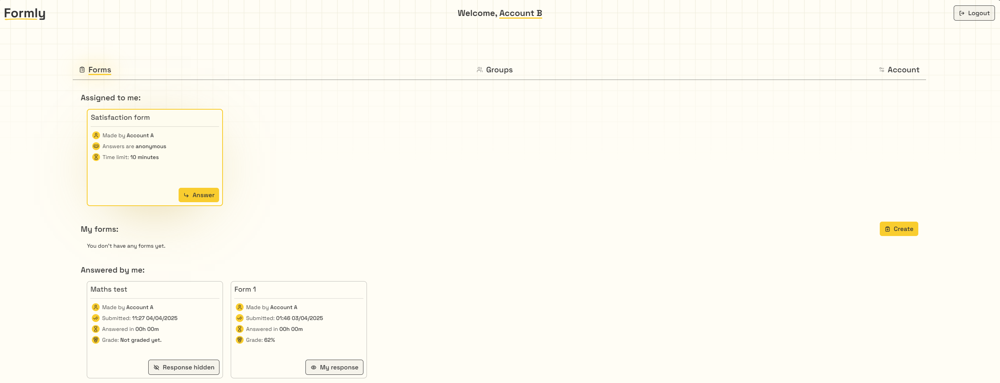

Forms app. The goal is to create user friendly testing environment intended for schools and companies. User can create different groups of respondents to easily assign forms to many people at the same time.
When creating a form, user can select correct answers in closed questions that will be automatically graded after response. 

Form author can access a list of currently responding and submitted responses to actively check the results and grade answers.

Users can see all the forms that in three categories: Assigned to me, My forms and Answered by me where they can check their response and grade.

